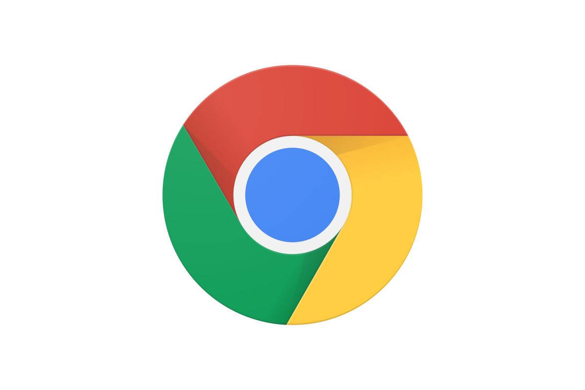
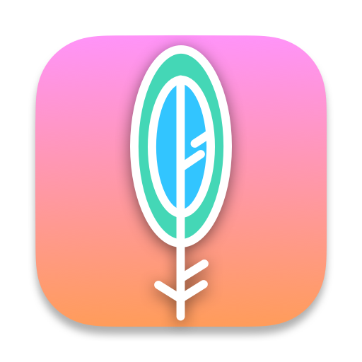
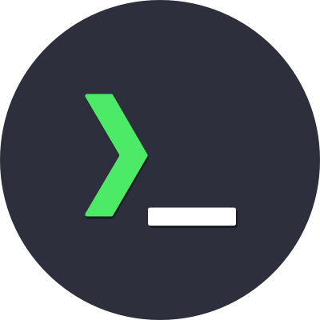
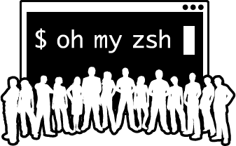
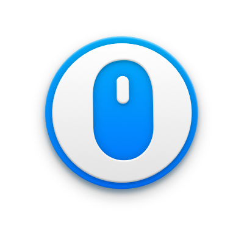

# Mac Setup

Make a MacBook extremely productive for developers.

  

## TOC

- [Climb Out of the GFW](#climb-out-of-the-gfw)
- [Get Apple's Dev Toolchain](#get-apples-dev-toolchain)
- [Get Package Manager](#get-package-manager)
- [Get a Real Browser](#get-a-real-browser)
- [Install Fonts](#install-fonts)
- [Get a Clipboard History Manager](#get-a-clipboard-history-manager)
- [Authenticate with GitHub CLI](#authenticate-with-github-cli)
- [Set Git Identity](#set-git-identity)
- [Set Up Node.js Version Management](#set-up-nodejs-version-management)
- [Get a Better Terminal](#get-a-better-terminal)
- [Switch Apps Without Touching the Trackpad](#switch-apps-without-touching-the-trackpad)
- [Get Code Editor](#get-code-editor)
- [Don't Type, Just Speak](#️-dont-type-just-speak)
- [Get Your AI Coding Partner](#get-your-ai-coding-partner)
- [Make the Shell Usable](#make-the-shell-usable)
- [Set Up Shell Aliases](#set-up-shell-aliases)
- [Fix Long-Press Behavior for Vim](#fix-long-press-behavior-for-vim)
- [Screenshot and Pin Anything](#screenshot-and-pin-anything)
- [Run LLMs Locally](#run-llms-locally)
- [Fix Mouse Scroll Direction](#fix-mouse-scroll-direction)
- [Enable Three-Finger Drag on Trackpad](#enable-three-finger-drag-on-trackpad)
- [Use F-Keys Without Holding Fn](#use-f-keys-without-holding-fn)

---

# Setup Checklist

##  Climb Out of the GFW

Install ClashV-Ninja: [jinkela.app](jinkela.app)

##  Get Apple's Dev Toolchain

Install Xcode from App Store, or run in terminal:

```bash
xcode-select --install
```

##  Get Package Manager

Install Homebrew:

> Xcode Command Line Tools must be installed first.

```bash
/bin/bash -c "$(curl -fsSL https://raw.githubusercontent.com/Homebrew/install/HEAD/install.sh)"
```

##  Get a Real Browser

Install Chrome:

> Requires ClashV-Ninja (proxy) to be set up first in 🇨🇳.

Download: https://www.google.com/chrome/

## Install Fonts

> Fonts for coding and terminal.

```bash
# Terminal font
brew install --cask font-iosevka

# Code font
brew install --cask font-monaspace
```

##  Get a Clipboard History Manager

```bash
# Clipboard manager
brew install --cask maccy
```

##  Authenticate with GitHub CLI

```bash
brew install gh
gh auth login
```

##  Set Git Identity

```bash
git config --global user.name "your-username"
git config --global user.email "your-email@example.com"
```

##  Set Up Node.js Version Management

Install fnm and Node.js:

> Tools like Claude Code depend on Node.js. Use [fnm](https://github.com/Schniz/fnm) (Fast Node Manager) to manage versions.

```bash
brew install fnm
```

Add to `~/.zshrc`:

```bash
eval "$(fnm env --use-on-cd --shell zsh)"
```

Then install Node.js:

```bash
fnm install --lts
fnm default lts-latest
```

##  Get a Better Terminal

Install iTerm2: https://iterm2.com/downloads.html

Then install Shell Integration (enables inline image display in terminal):

```bash
curl -L https://iterm2.com/shell_integration/install_shell_integration_and_utilities.sh | bash
```

> **Note:** iTerm2 is the best terminal overall, but it has some rendering issues when used with Coding CLIs like Claude Code. If you are a heavy Claude Code user, consider using [Kaku](https://github.com/tw93/kaku) instead.

**Kaku shortcuts:**

| Shortcut | Action |
|----------|--------|
| `Cmd+Shift+P` | Open command palette |
| `Cmd+T` | New tab |
| `Cmd+1/2/3...` | Switch to tab by number |
| `Cmd+D` | Split pane to the right |
| `Cmd+Shift+D` | Split pane below |
| `Cmd+W` | Close current pane |

##   Switch Apps Without Touching the Trackpad

Set up app-switching shortcuts with Raycast + Karabiner-Elements:

- Install [Raycast](https://www.raycast.com/)
- Install [Karabiner-Elements](https://karabiner-elements.pqrs.org)
- Remap Caps Lock to Hyper Key (Ctrl+Shift+Alt+Cmd)
- Configure Raycast hotkeys:
    - `Caps + H` → Chrome
    - `Caps + V` → VSCode
    - `Caps + L` → Lark
    - `Caps + O` → Obsidian
    - `Caps + S` → Superhuman
    - `Caps + M` → Outlook
    - ...

##  Get Code Editor

Install VSCode:

1. Install [VSCode](https://code.visualstudio.com/)
2. Sign in with GitHub to sync settings
3. Install Vim extension
4. Install Markdown Preview GitHub extension

## ⌨️ Don't Type, Just Speak.

Install [Typeless](https://typeless.app/)

##  Get Your AI Coding Partner

Install Claude Code:

```bash
curl -fsSL https://claude.ai/install.sh | bash
```

##  Make the Shell Usable

Installing and configuring oh-my-zsh (with plugins, themes, etc.) is a bit tedious. Just let Claude Code handle it — ask it to install and set up oh-my-zsh for you.

## Set Up Shell Aliases

Configure `~/.zshrc`

> ⚠️ For reference only — adjust to your own needs.

```bash
alias pull="git pull"
alias gco="git checkout"

alias proxy="export https_proxy=http://127.0.0.1:6789 http_proxy=http://127.0.0.1:6789 all_proxy=socks5://127.0.0.1:6789 && echo '✅ proxy configured in current session'"
alias claude="proxy && claude --dangerously-skip-permissions"

alias zshconf="vim ~/.zshrc"
alias reloadzsh="source ~/.zshrc"
```

##  Fix Long-Press Behavior for Vim

Enable key repeat on long press:

```bash
defaults write -g ApplePressAndHoldEnabled -bool false
```

> By default macOS shows an accent picker on long press. This disables it so keys repeat instead (useful for Vim).

##  Screenshot and Pin Anything

Install [Snipaste](https://www.snipaste.com/)

- Press `F1` to take a screenshot (if it doesn't work, try `Fn+F1` — or adjust the F-key behavior in the [Use F-Keys Without Holding Fn](#use-f-keys-without-holding-fn) section).
- Click **Pin** to paste the screenshot onto the desktop.
- Drag a pinned image to reposition it;
- Double-click it to dismiss.

##  Run LLMs Locally

Install [Ollama](https://ollama.com/):

```bash
curl -fsSL https://ollama.com/install.sh | sh
```

##  Fix Mouse Scroll Direction

Install [Mac Mouse Fix](https://macmousefix.com/)

macOS only lets you pick one scroll direction for everything. Mac Mouse Fix decouples the two: trackpad keeps its natural scroll direction, while the mouse wheel is reversed to match physical expectations.

## Enable Three-Finger Drag on Trackpad

In **System Settings → Accessibility → Pointer Control → Trackpad Options**, enable **"Use trackpad for dragging"** and set the dragging style to **"Three-Finger Drag"**.

This lets you drag windows and select text by moving three fingers, without needing to click and hold.

## Use F-Keys Without Holding Fn

In **System Settings → Keyboard**, enable **"Use F1, F2, etc. keys as standard function keys"**.

By default, bare F-key presses trigger media controls (brightness, volume); you need Fn+F1 to send a real function key. Flipping this setting reverses the behavior — F1 sends a real function key directly, and Fn+F1 triggers media controls instead.
